# VOLTRA

> Aplicativo de gestão inteligente de combustível para motoristas de carros de motores a combustão. O app tem como objetivo informar o usuário o consumo de combustível, além disso através do hardware (esp32 + módulo GPS) informar a última rota percorrida.

---

## 📎 Visão Geral

**VOLTRA** é um aplicativo mobile Android projetado para melhorar a experiência de motoristas em diferentes frentes:  
- Avaliação de combustível para veículos a combustão  
- Monitoramento e segurança veicular

O projeto está sendo desenvolvido como parte da disciplina de **Desenvolvimento Mobile**, mas posteriormente pretendemos adicionar mais funcionalidades.

---

## Objetivos

 Ajudar usuários a **identificar combustível de baixa qualidade** e evitar prejuízos mecânicos
 Oferecer um sistema de **rastreamento e segurança veicular** com monitoramento em tempo real
 Centralizar múltiplas necessidades do motorista em uma única interface intuitiva

---

## Público-Alvo

Motoristas brasileiros que:
Desejam monitorar o desempenho de combustível dos seus veículos a combustão
Buscam mais segurança e controle sobre a localização e uso dos seus carros

---

###  Veículos a Combustão

- **Avaliação da Qualidade de Combustível**  
  Histórico de abastecimento e desempenho, utilizando sensores e análise dos dados de consumo (simulação via Arduino com potenciômetros).

- **Tracking de desempenho do veículo com determinado combustível**  
  Indicação se o combustível atende os padrões da legislação brasileira.

---

###  Segurança Veicular

 **Localização em Tempo Real**  
  Monitoramento contínuo da posição do veículo.

 **Histórico de Rotas**  
  Registro completo de trajetos realizados.

 **Notificações de Segurança**  
  Alertas por push em caso de movimentação não autorizada ou ignição indevida.

 **Compartilhamento de Acesso**  
  Possibilidade de familiares ou outros usuários acompanharem o veículo.

---

##  Interface (UI/UX)

Repositório Figma: https://www.figma.com/design/FsyTdu0DmyYDz0sEgpbS6h/Voltra?node-id=28-159&p=f&t=LWggTVPleiLZkM7w-0

### Estrutura de Telas:
- **Tela de Boas-Vindas / Onboarding**
- **Login e Cadastro de Usuário**
- **Tela Principal (Mapa Interativo)**
- **Fila Virtual de Carregamento**
- **Histórico de Trajetos e Abastecimentos**
- **Perfil e Configurações do Veículo**
- **Central de Segurança e Notificações**

---

##  Tecnologias e Ferramentas

 **Figma** – Prototipação e UI Design  
 **Flutter** – Desenvolvimento mobile  
 **Mapbox API** – Geolocalização
 **Firebase** – Autenticação, notificações e backend básico  
 **ESP32+ Sensores** – Modulo Gps Para Arduino Esp32 Neo-6m Gy Neo6mv2

 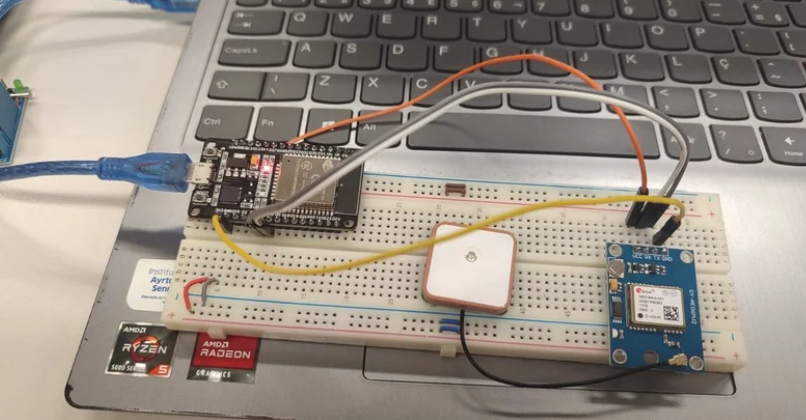
---

##  Slide

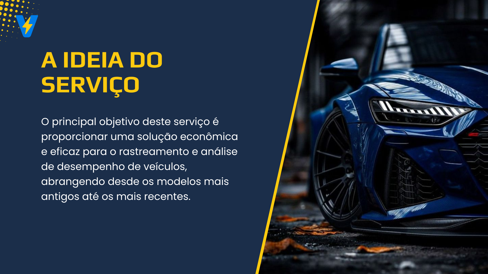
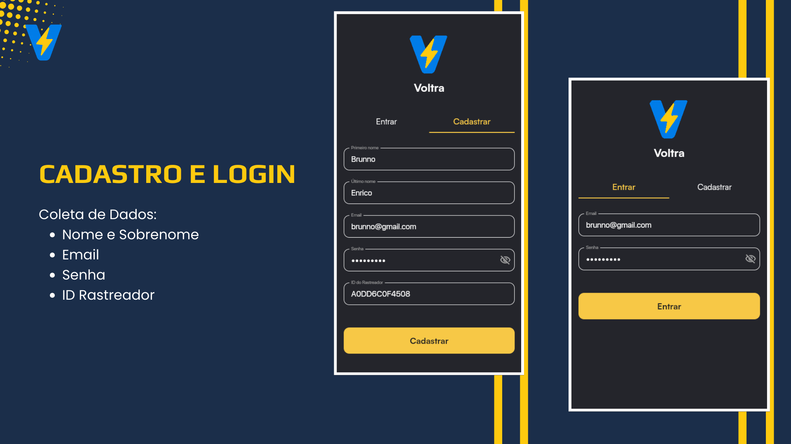
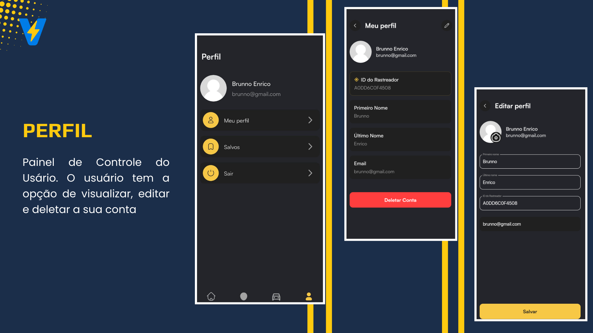

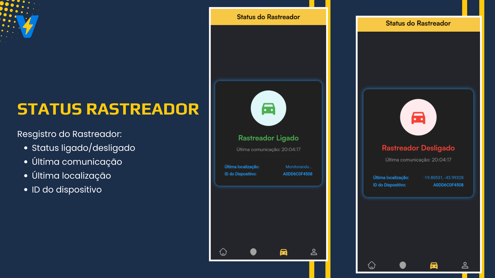
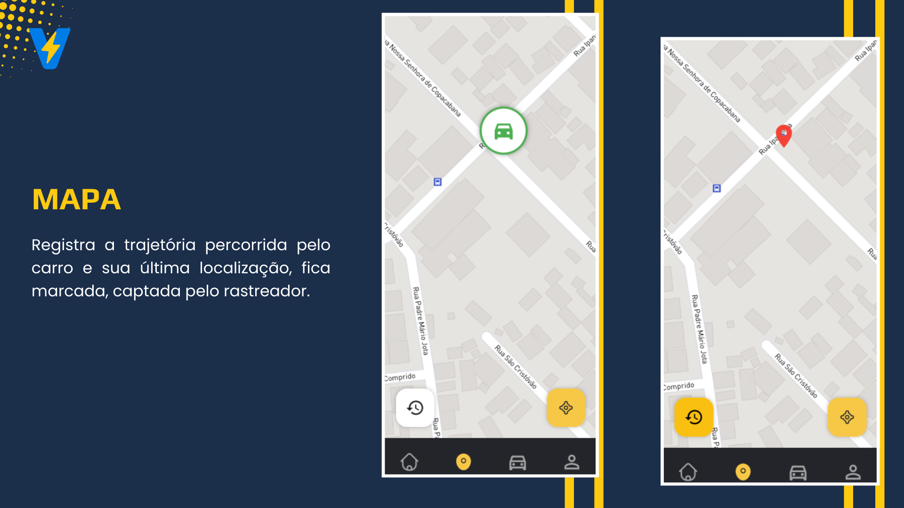
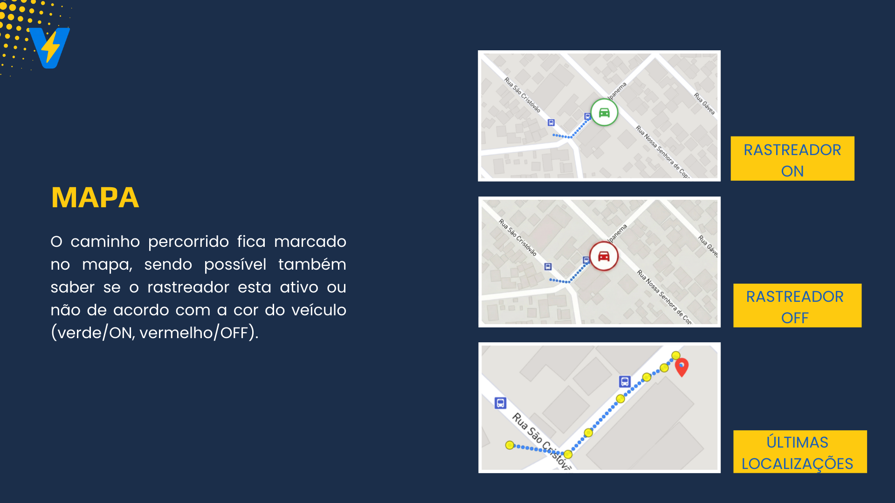
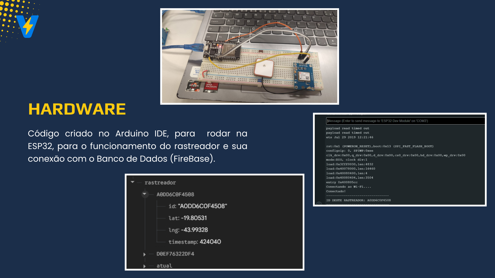

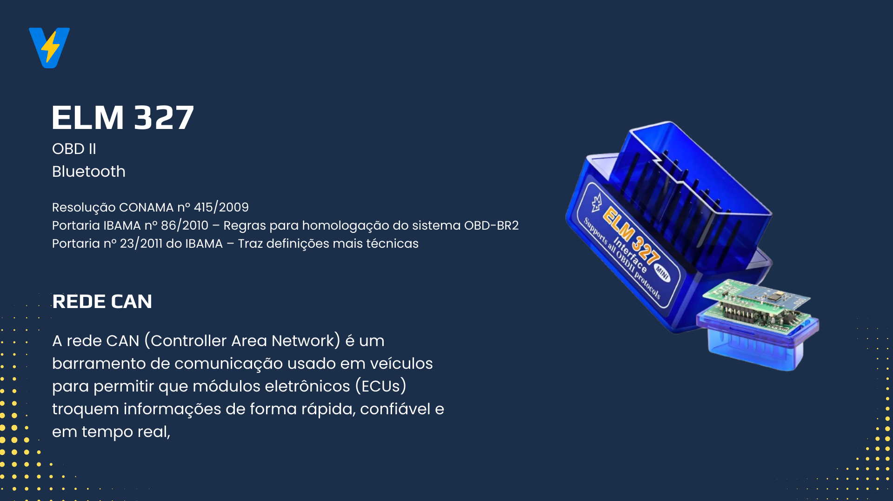
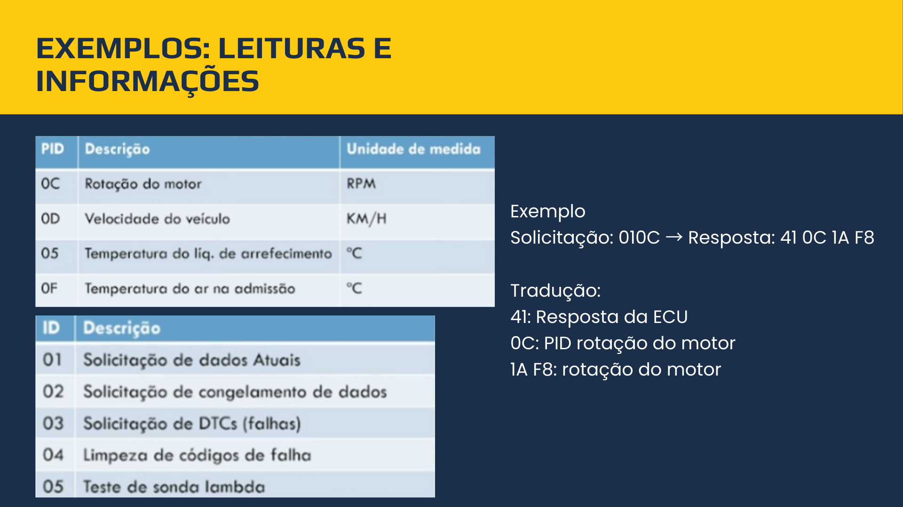

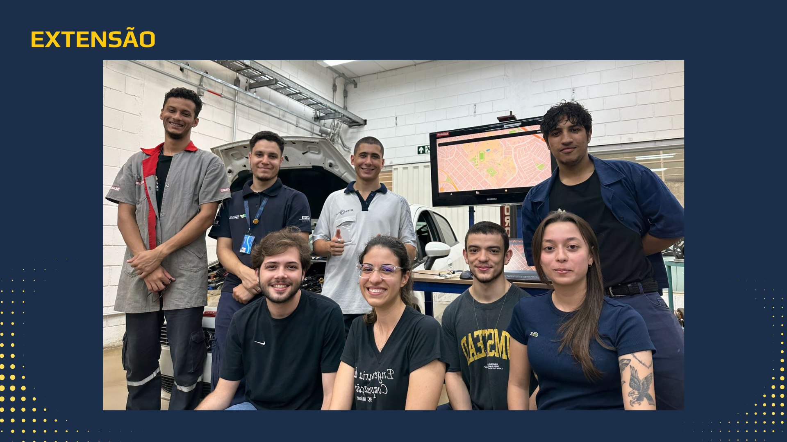

